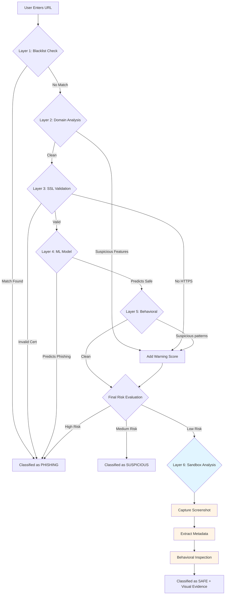

# Phishing URL Detection 


## System Architecture: 6-Layer Phishing Detection
The project features a robust, enterprise-grade security pipeline consisting of 6 sequential layers:



### Detection Layers
1. **Layer 1 - Blacklist Check**: Instantly blocks known malicious domains from a local or remote blacklist.
2. **Layer 2 - Domain Analysis**: Heuristic analysis of domain length, subdomain count, TLD reputation, and brand impersonation.
3. **Layer 3 - SSL/TLS Verification**: Checks for valid HTTPS certificates and secure connections.
4. **Layer 4 - AI/ML Model**: Uses the trained gradient boosting classifier to analyze deep content features.
5. **Layer 5 - Behavioral Analysis**: Checks for obfuscation techniques (e.g., using IP instead of domain, multiple redirects).
6. **Layer 6 - Sandbox Analysis** ⭐ NEW: Safely opens URLs in an isolated headless browser to capture screenshots and inspect behavioral patterns.

### 🆕 Sandbox Analysis Features
The Sandbox Analysis layer provides **visual evidence** and **behavioral inspection** without exposing users to risk:

#### What It Does:
- ✅ Opens URLs in an isolated headless browser (Playwright)
- ✅ Captures full-page screenshots
- ✅ Tracks redirects and final destination
- ✅ Extracts metadata (IP address, page title, load time)
- ✅ Detects login forms and password fields
- ✅ Scans for suspicious phishing keywords
- ✅ Blocks private IPs and localhost (SSRF protection)

#### Security Measures:
- 🔒 Incognito browser context (no cookies/cache)
- 🔒 Downloads disabled
- 🔒 Strict 15-second timeout
- 🔒 Private IP blocking (127.0.0.1, 10.x.x.x, 192.168.x.x)
- 🔒 No form submission or interaction
- 🔒 Automatic browser cleanup

#### Limitations:
- ⚠️ Cannot detect time-delayed attacks
- ⚠️ May be blocked by bot detection systems
- ⚠️ Attackers may serve different content to sandbox IPs
- ⚠️ HTTPS does not guarantee safety

## Objective
A phishing website is a common social engineering method that mimics trustful uniform resource locators (URLs) and webpages. The objective of this project is to train machine learning models and deep neural nets on the dataset created to predict phishing websites. Both phishing and benign URLs of websites are gathered to form a dataset and from them required URL and website content-based features are extracted. The performance level of each model is measures and compared.

## Installation
To install the required packages and libraries, run this command in the project directory after Forking and cloning this repository:
```bash
pip install -r requirements.txt
```

### Additional Setup for Sandbox Analysis
To enable the Sandbox Analysis feature, install Playwright:
```bash
pip install playwright
playwright install chromium
```

**Note**: Sandbox analysis will gracefully degrade if Playwright is not installed. The main 5-layer pipeline will continue to work normally.

## Technologies Used


[](https://numpy.org/doc/) [](https://pandas.pydata.org/pandas-docs/stable/reference/api/pandas.DataFrame.html)
[](https://matplotlib.org/)
[](https://scikit-learn.org/stable/) 
[](https://flask.palletsprojects.com/en/2.0.x/) 

**New**: [Playwright](https://playwright.dev/) - Headless browser automation for sandbox analysis

## Feature Extraction
The system starts by retrieving URLs to be checked for phishing. These URLs can be collected from user input in the webpage created. Once the URLs are obtained, the system extracts relevant features from the web pages. These features are essential for training and evaluating the machine learning models. Various features were extracted from the URL database based on Domain, HTML and Address bar of the URLs. 

## Machine Learning Models

Various machine learning models are compared and The machine learning model with high accuracy is selected which predicts whether the URL is a phishing site or not. It provides a probability score or a binary classification (phishing or not phishing) based on the trained model's decision boundary. The system categorize URLs into "phishing" or "legitimate" and the result is finally displayed on the webpage. 
#### Refer Phishingproject.ipynb for more details.

## Result

Accuracy of various model used for URL detection
<br>

<br>

||ML Model|	Accuracy|  	f1_score|	Recall|	Precision|
|---|---|---|---|---|---|
0|	Gradient Boosting Classifier|	0.974|	0.977|	0.994|	0.986|
1|	CatBoost Classifier|	        0.972|	0.975|	0.994|	0.989|
2|	Multi-layer Perceptron|	        0.969|	0.973|	0.995|	0.981|
3|	Random Forest|	                0.967|	0.971|	0.993|	0.990|
4|	Support Vector Machine|	        0.964|	0.968|	0.980|	0.965|
5|	Decision Tree|      	        0.960|	0.964|	0.991|	0.993|
6|	K-Nearest Neighbors|        	0.956|	0.961|	0.991|	0.989|
7|	Logistic Regression|        	0.934|	0.941|	0.943|	0.927|
8|	Naive Bayes Classifier|     	0.605|	0.454|	0.292|	0.997|

## Testing Sandbox Analysis

Run the test script to verify the sandbox implementation:
```bash
python test_sandbox.py
```

This will test:
- URL validation and normalization
- IP address checking
- Sandbox analyzer functionality (if Playwright is installed)

## Conclusion
1. The final take away form this project is to explore various machine learning models, perform Exploratory Data Analysis on phishing dataset and understanding their features. 
2. Creating this notebook helped me to learn a lot about the features affecting the models to detect whether URL is safe or not, also I came to know how to tuned model and how they affect the model performance.
3. The final conclusion on the Phishing dataset is that the some feature like "HTTTPS", "AnchorURL", "WebsiteTraffic" have more importance to classify URL is phishing URL or not.
4. Gradient Boosting Classifier currectly classify URL upto 97.4% respective classes and hence reduces the chance of malicious attachments.
5. **NEW**: The Sandbox Analysis layer adds visual evidence and behavioral inspection, making the system comparable to enterprise SaaS tools like VirusTotal and urlscan.io.
