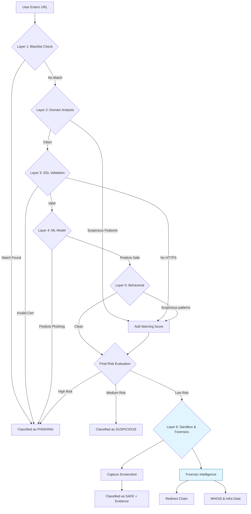

# Phishing Website Detector 🛡️

A state-of-the-art, enterprise-grade phishing detection system that combines **Machine Learning**, **Heuristic Analysis**, and **Sandboxed Browser Automation** to identify malicious websites with 97.4% accuracy.


## 🚀 Key Features

*   **6-Layer Security Pipeline**: From instant blacklist checks to deep ML content analysis.
*   **Brand Impersonation Scanner**: Detects typosquatting (e.g., `paypa1.com`) and homoglyphs with improved accuracy.
*   **Email Link Scanner**: Extracts and analyzes multiple URLs from email text without storing content.
*   **Forensic Intelligence**: Deep-dive analysis of redirects, shorteners (bit.ly, t.co), WHOIS data, and infrastructure.
*   **Sandbox Analysis**: Safely detonates URLs in a headless browser to capture screenshots and behavioral data.
*   **Decentralized Platform Detection**: Identifies hosting on IPFS, Vercel, etc., to warn about dynamic content.
*   **Enterprise UI**: A premium, responsive dashboard with Dark/Light mode, animations, and glassmorphism design.
*   **Real-time scanning**: Analyzes live URLs in seconds.

---

## 🏗️ System Architecture: 6-Layer Pipeline

This project employs a defense-in-depth approach:



### 🔬 The 6 Layers Explained

1.  **Blacklist Check**: Instant blocking of known malicious domains.
2.  **Domain Analysis**: Typosquatting detection, high-entropy domains, and brand impersonation checks.
3.  **SSL/TLS Verification**: Validates certificate chain and issuer trust.
4.  **AI/ML Model**: A **Gradient Boosting Classifier** trained on 11,000+ URLs to analyze content features (forms, javascript, obfuscation).
5.  **Behavioral Analysis**: Detects evasion techniques like multiple redirects or IP-based hosting.
6.  **Sandbox & Forensics**:
    *   **Forensic Intelligence**: Traces redirect chains, analyzes WHOIS properties (registrar, domain age), and identifies server infrastructure.
    *   **Visual Evidence**: Captures full-page screenshots in a secure, headless container.

---

## 💻 Tech Stack

*   **Backend**: Python, Flask
*   **Machine Learning**: Scikit-learn (Gradient Boosting, Random Forest), Pandas, NumPy
*   **Browser Automation**: Playwright (Chromium)
*   **Network Analysis**: Python-Whois, Requests, Socket
*   **Frontend**: HTML5, CSS3 (Variables, Flexbox/Grid), JavaScript (Vanilla)

---

## 🛠️ Installation

### Prerequisites
*   Python 3.8+
*   Pip

### Setup

1.  **Clone the repository**:
    ```bash
    git clone https://github.com/yourusername/Phishing-Website-Detector.git
    cd Phishing-Website-Detector
    ```

2.  **Install Dependencies**:
    ```bash
    pip install -r requirements.txt
    ```

3.  **Install Playwright Browsers** (Required for Sandbox):
    ```bash
    playwright install chromium
    ```

4.  **Run the Application**:
    ```bash
    python app.py
    ```
    Access the app at `http://localhost:5000`

---

## 📊 Performance

The model was trained and evaluated on a diverse dataset of legitimate and phishing URLs.

| Model | Accuracy | Precision | Recall | F1 Score |
|-------|----------|-----------|--------|----------|
| **Gradient Boosting** | **97.4%** | **98.6%** | **99.4%** | **97.7%** |
| CatBoost | 97.2% | 98.9% | 99.4% | 97.5% |
| Random Forest | 96.7% | 99.0% | 99.3% | 97.1% |
| SVM | 96.4% | 96.5% | 98.0% | 96.8% |

---

## 🕵️‍♂️ Forensic Capabilities

The new **Forensic Intelligence** module provides:

*   **Redirect Map**: Visualizes every hop in the redirection chain to detect cloaking.
*   **Infrastructure Data**: Extracts Root Domain, Server IP, and Registrar.
*   **Risk Indicators**: Automatically flags risks like "Newly Registered Domain" (< 30 days) or "Complex Redirects".

---

## 📜 License

This project is licensed under the MIT License - see the [LICENSE](LICENSE) file for details.
